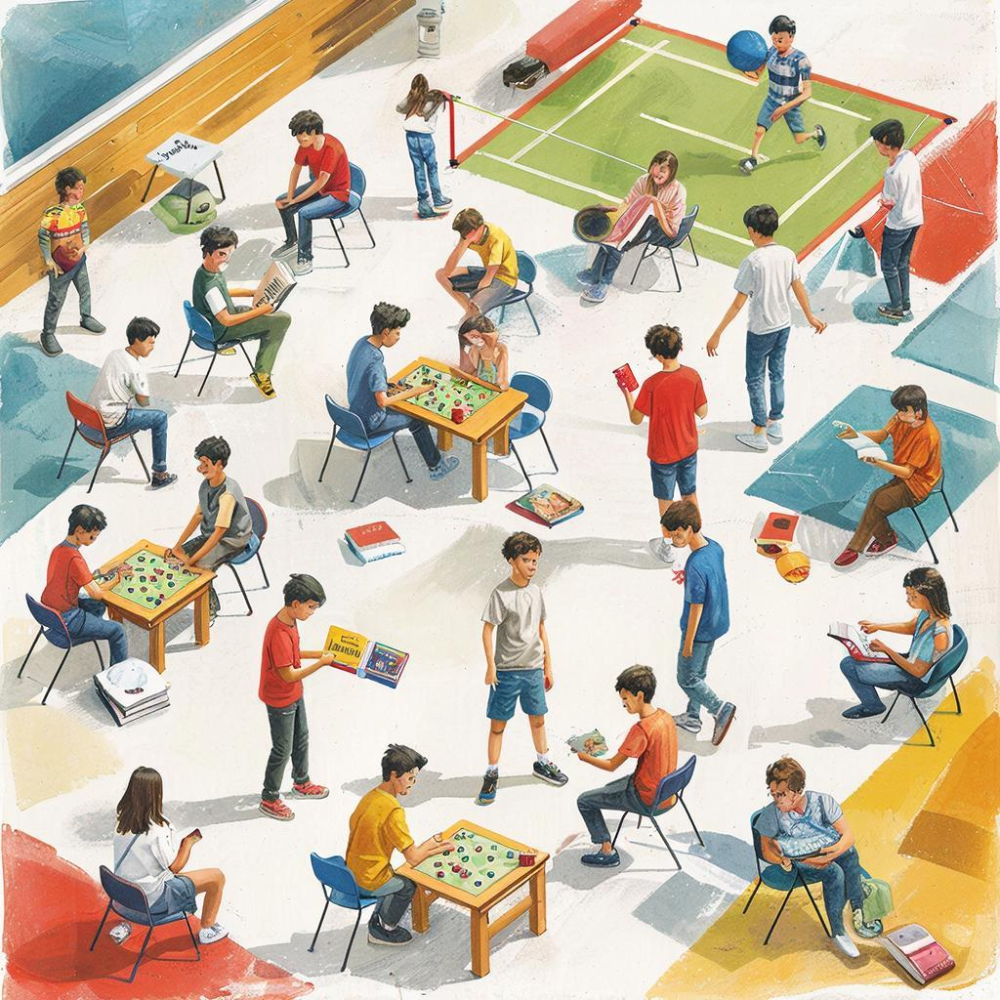

## 🌟 Как провести время весело и бесплатно 🎮📚

### 🔍 Определение досуга

Досуг — это та самая область жизни человека, когда ты отдыхаешь от повседневных забот и обязанностей. **Досуг** помогает нам восстановить силы, расслабиться и набраться энергии перед новыми свершениями. Обычно досуг включает разные виды деятельности, развлечения и занятия, которые приносят удовольствие и радость.

---

### ✨ Какие виды досуга существуют?

Есть много разных видов досуга, среди которых выделяют:

- **Кино и театр**: просмотр фильмов и спектаклей всегда увлекательно и позволяет узнать что-то новое!
- **Чтение книг**: погружение в интересный сюжет и мир фантазии делают чтение отличным способом проведения свободного времени.
- **Спортивные игры**: футбол, волейбол, бадминтон — активные занятия укрепляют здоровье и поднимают настроение.
- **Туризм и путешествия**: походы в лес, экскурсии по городам расширяют кругозор и помогают отвлечься от рутины.
- **Хобби**: рисование, вязание, фотография — хобби позволяют творчески самовыражаться и развивать полезные навыки.
  
---

### 💡 Что делать дома бесплатно?

Даже находясь дома, можно найти массу интересных занятий:

1. **Просмотр документальных фильмов и познавательных передач**: узнай что-то удивительное прямо сейчас!

   
2. **Проведение интеллектуальных игр**: викторины, шахматы, настольные игры развивают мышление и улучшают коммуникацию.
3. **Творческие мастер-классы онлайн**: учись новому через вебинары и уроки мастерства, не выходя из дома.
4. **Общение с друзьями и семьей**: иногда самые лучшие развлечения происходят именно тогда, когда мы вместе проводим время.
5. **Занятия самообразованием**: изучение иностранных языков, чтение специализированной литературы, развитие новых компетенций.

---

### 🌍 Путешествия вокруг тебя

Часто людям кажется, что путешествия требуют больших затрат. Но на самом деле, интересные места находятся совсем рядом с домом. Попробуй посетить местные парки, музеи, выставки и кафе. Это позволит тебе лучше узнать свою местность и насладиться природой и культурой родного края.

---

### 🐾 Домашние питомцы и животные

Забота о домашних животных приносит радость и умиротворение. Общение с собаками, кошками, птицами или даже рыбками помогает снять стресс и почувствовать себя частью большого мира природы.

---

### 🎸 Музыка и искусство

Послушай любимые песни или научись играть на музыкальном инструменте. Можно попробовать петь караоке или создать собственное музыкальное произведение. А еще попробуй рисовать или заниматься каллиграфией — это развивает креативность и улучшает эмоциональное состояние.

---

### 👩‍🏫 Заключение

Теперь ты знаешь, сколько всего интересного можно сделать бесплатно! Не обязательно тратить деньги, чтобы отдохнуть и получить удовольствие. Главное — это твоё желание и стремление искать новые впечатления и возможности для развития. Пусть твой досуг будет ярким и насыщенным!

---

*Автор: Миронов Данил • Сгенерировано с помощью GigaChat*