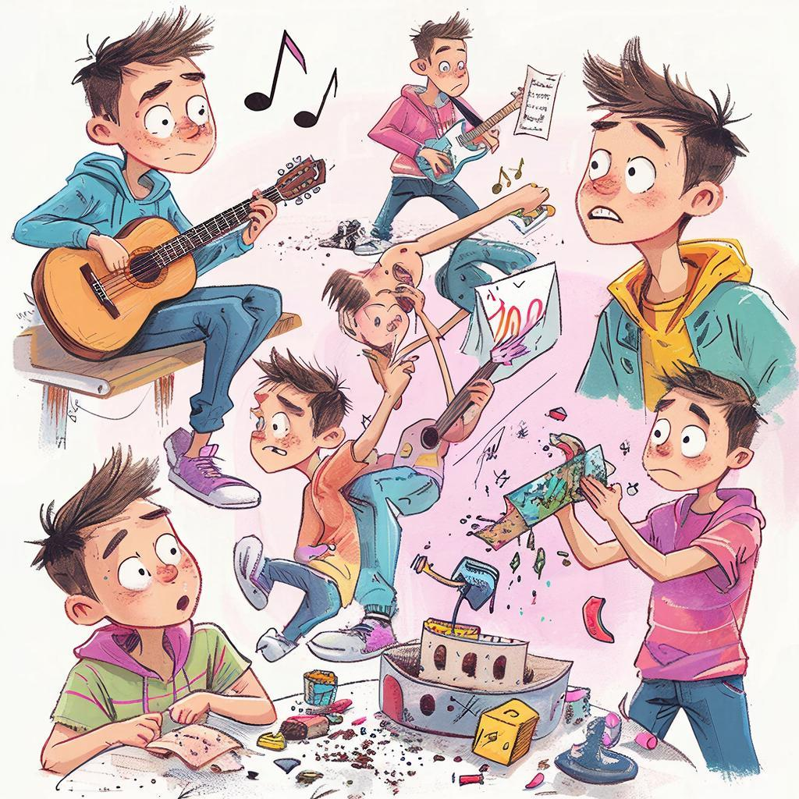

# 🎨 Ошибки при выборе хобби 🎯

## Определение увлечения 📚

Увлечение — это занятие или деятельность, доставляющая радость и удовольствие человеку. Это может быть рисование, спорт, музыка, кулинария или путешествия. Но иногда мы совершаем ошибки, выбирая себе дело по душе. Сегодня поговорим именно об этом!

---

## Почему важно выбрать правильное увлечение? ❤️🌟

Правильное увлечение помогает развиваться, расширять кругозор и приносит положительные эмоции. Оно делает нас счастливыми и успешными во всех сферах жизни. Например, занятия спортом укрепляют здоровье, чтение книг развивает мышление, танцы улучшают координацию движений.

---

## Самые распространенные ошибки 📈✏️

### 1. Неоправданные ожидания 😒

Часто подростки выбирают хобби, ориентируясь на мнение окружающих или тренды в интернете. Пример: ты решил стать программистом, потому что видел крутые видео про разработку игр, но сам процесс оказался совсем другим. Важно понимать, подходит ли тебе выбранное направление и принесет ли оно удовлетворение.

### 2. Недостаточная увлеченность 🔥

Иногда человек выбирает хобби ради статуса или одобрения родителей, друзей, а не искренне. Подумай хорошенько, действительно ли тебе нравится рисовать пейзажи, заниматься плаванием или фотографией? Если нет искреннего интереса, велика вероятность быстро потерять мотивацию.

### 3. Слишком высокая планка 🎯

Некоторые ребята ставят перед собой нереалистичные цели. Они мечтают выиграть соревнования по шахматам через месяц занятий или получить диплом дизайнера интерьеров после нескольких уроков рисования. Такие завышенные требования приводят к разочарованию и стрессу.

---

## Как избежать ошибок 👀🐱

Чтобы правильно выбрать хобби, следуй простым рекомендациям:

- **Экспериментируй**: попробуй разные направления и выбери то, что вызывает восторг.
- **Обрати внимание на себя**: учись замечать, какие занятия вызывают интерес и удовольствие лично у тебя.
- **Ставь реалистичные цели**: разбей большие мечты на маленькие шаги и двигайся постепенно.

---

## Заключение 🛍️💖

Выбор хобби — важный жизненный этап. Чтобы найти своё увлечение, нужно проявить терпение и внимательность. Помни, успех приходит тогда, когда мы занимаемся любимым делом с удовольствием и вдохновением. Удачи в поиске своего идеального хобби!

---

*Автор: Заворотный Алексей • Сгенерировано с помощью GigaChat*